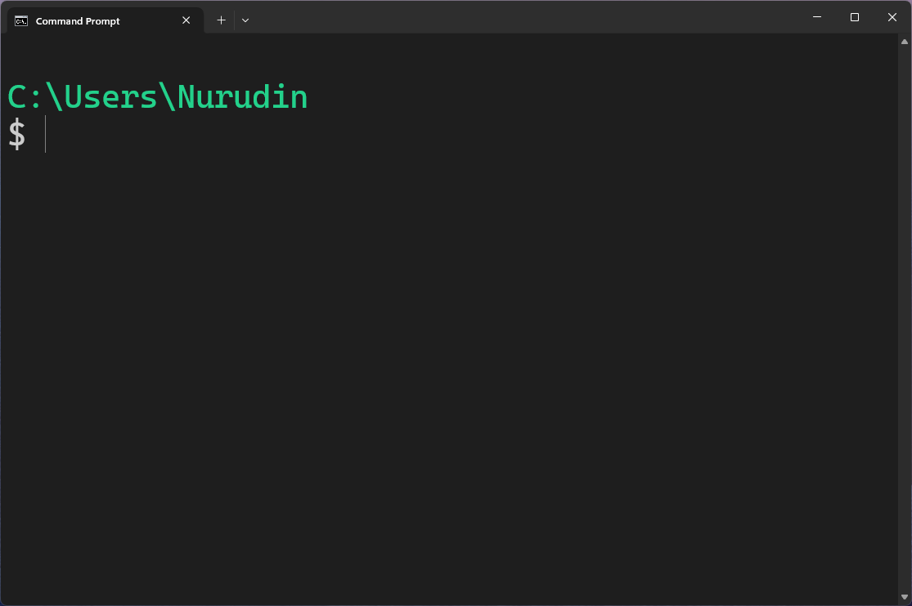

# cmdrc

Command Prompt Configuration (and _enhancement_) Files

## Installation

1. [Download repository as a zip file.](https://github.com/imshvc/cmdrc/archive/refs/heads/main.zip)
2. Extract **.cmd** folder to **%USERPROFILE%** e.g. your user folder: C:\Users\JohnDoe
3. Import the registry file **install.reg**

Command Prompt should look like this:

